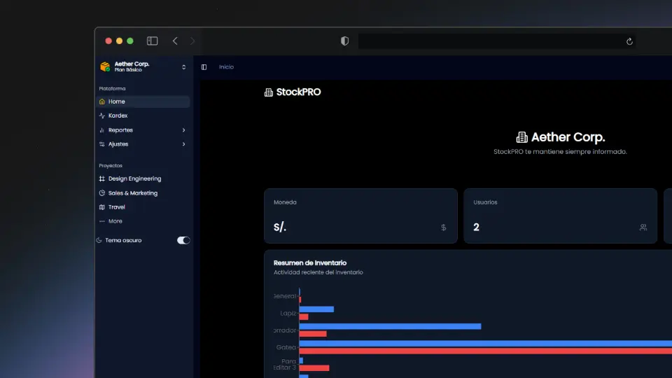

# Sistema de Control de Stock

<p align="center">
  
</p>

Un sistema moderno de gestión de inventario construido con React, TypeScript y Vite, que ofrece una interfaz intuitiva para el control y seguimiento de productos, kardex y reportes.

## Características Principales ✨

- 📦 Gestión completa de productos y categorías
- 📊 Sistema Kardex para entradas y salidas
- 🔍 Seguimiento detallado del inventario
- 📈 Reportes avanzados en PDF
  - Inventario valorizado
  - Stock actual
  - Movimientos de Kardex
  - Productos con bajo stock
  - Stock por producto
- 👥 Gestión de usuarios y permisos
- 🏢 Configuración de empresa
- 🌓 Tema claro/oscuro
- 📱 Diseño responsive

## Tecnologías Utilizadas 🛠️

- **Frontend:**

  - React + TypeScript
  - Vite
  - TanStack Query (React Query)
  - TanStack Table
  - Tailwind CSS
  - Shadcn/ui
  - React PDF
  - Lucide Icons

- **Gestión de Estado:**

  - Zustand

- **Backend/Base de Datos:**
  - Supabase

## Instalación 🚀

1. Clona el repositorio:

```bash
git clone https://github.com/WillJkdev/stock-control-system.git
cd stock-control-system
```

2. Instala las dependencias:

```bash
npm install
```

3. Copia el archivo de variables de entorno y configúralo:

```bash
cp .env.example .env
```

4. Configura tus variables de entorno en el archivo `.env`:

```env
VITE_SUPABASE_URL=tu_url_de_supabase
VITE_SUPABASE_ANON_KEY=tu_clave_anonima_de_supabase
```

5. Inicia el servidor de desarrollo:

```bash
npm run dev
```

## Estructura del Proyecto 📁

```
src/
  ├── components/          # Componentes React
  │   ├── atoms/          # Componentes base
  │   ├── molecules/      # Componentes compuestos
  │   ├── organisms/      # Componentes complejos
  │   ├── templates/      # Plantillas de página
  │   └── ui/            # Componentes de UI reutilizables
  ├── config/            # Configuraciones
  ├── context/           # Contextos de React
  ├── hooks/             # Custom hooks
  ├── lib/              # Utilidades y funciones
  ├── store/            # Estado global (Zustand)
  ├── supabase/         # Configuración y queries de Supabase
  └── types/            # Definiciones de TypeScript
```

## Características Detalladas 🔍

### Sistema Kardex

- Registro de entradas y salidas de productos
- Histórico de movimientos
- Seguimiento de stock en tiempo real
- Anulación de movimientos con trazabilidad

### Reportes

- Generación de PDFs profesionales
- Informes detallados de inventario
- Alertas de bajo stock
- Valorización del inventario
- Filtros y búsquedas avanzadas

### Gestión de Usuarios

- Control de acceso basado en roles
- Permisos granulares por módulo
- Registro de actividades por usuario

## Contribuir 🤝

1. Haz fork del proyecto
2. Crea una rama para tu característica (`git checkout -b feature/AmazingFeature`)
3. Commit tus cambios (`git commit -m 'Add some AmazingFeature'`)
4. Push a la rama (`git push origin feature/AmazingFeature`)
5. Abre un Pull Request

## Licencia 📝

Este proyecto está licenciado bajo la Licencia MIT - ver el archivo [LICENSE](LICENSE) para más detalles.

## ¡Gracias por contribuir! 🙌
